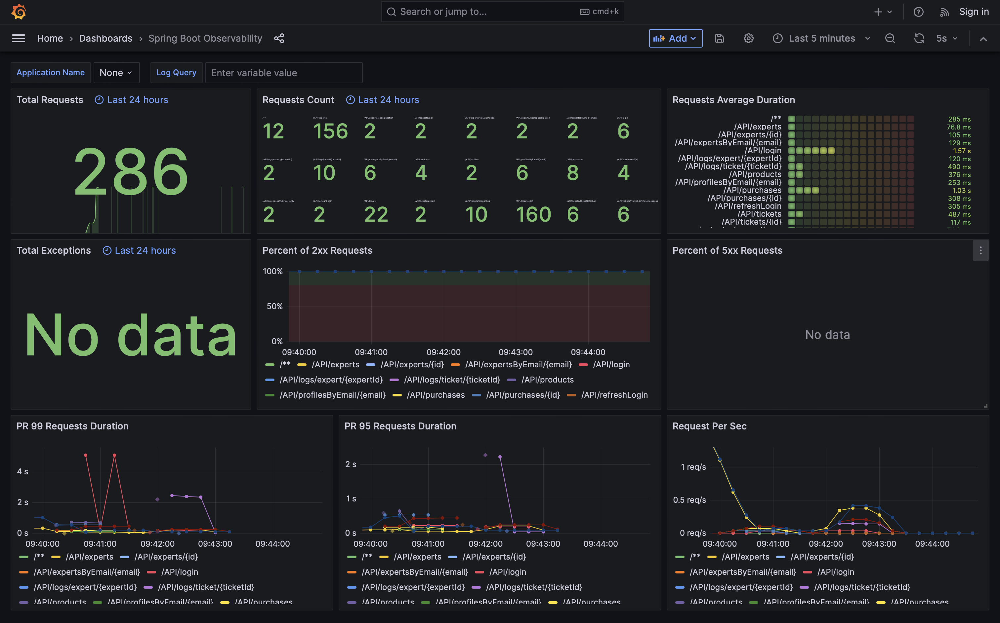

# Web Applications II Labs
### Repository for the laboratories of the Web Applications II course
The repository contains the 5 laboratories and the final project for the Web Applications II course (A.Y. 2022/23, Politecnico di Torino). Each folder contains the PDF of the assignment.

[🌐 Qui in italiano](README_it.md)

## Lab 1: Kotlin Exercism exercises
4 exercises from the Exercism Kotlin track: Flatten Array, Matrix, React and Word Count.

## Labs 2-5 and final project: Ticketing server
The following labs and the final project were aimed at creating a web application that allows customers of electronic goods to
submit assistance tickets, which are than managed by specialized experts and managers.

The application is what can be considered a proof of concept: its main goal was to test and showcase all the different technologies studied in the course, such as Spring Boot, Keycloak and the interaction of several microservices.  
This is why several choices have been made in light of the goal of the project: had this been a real application, different solutions would definitely need to be applied, as described in the limitations section.

The project focused mainly on the server, which was the focus of the course too; the final project, then, was aimed at testing the server by developing a client for it.

### Features
- Insert purchases and additional warranties (to emulate the purchase of a specific good online)
- Open tickets relative to a specific purchase
- Chat with experts to further explain the issue described in the ticket
- As an expert, manage the ticket status and priority level and chat with the customer
- As an expert, manage your own specializations (used by the managers to assign the tickets appropriately)
- As a manager, assign experts to tickets and evaluate experts' performances by analysing the changes made to the ticket statuses

### Horizontal features
- Gauge the performance of the system in the Grafana dashboard by monitoring the requests count, the average request duration, the percentage of successful and unsuccessful requests and the number of requests per second

### Technologies used
- Server
	- Spring Boot (Kotlin)
	- Spring Data JPA
	- PostgreSQL database
	- Spring Security
	- Keycloak
	- Grafana
	- Prometheus
	- Loki
	- Tempo
	- Docker Compose
	- Jib (for building the Docker image)
- Client
	- React
	- Bootstrap

### System architecture
The application is preferably started from the Docker Compose file, which starts several microservices. The `ticketing` microservice is the server itself, which exposes both the APIs and the client on port 8080. The PostgreSQL database is started on port 5432; all the other microservices collect data and support the monitoring of the system performance, which can be carried out from the Grafana dashboard accessible from port 3000.

### Known bugs and limitations
- The chat is updated by continuous polling: this was done due to time limitations, but other solutions, such as web sockets, would be recommended
- The implementation of Keycloak's exchange of tokens with the client is most likely wrong: it works, but it does not follow the common best practices. Again this is due to time limitations and the lack of documentation provided by Keycloak or by the course
- Several performance optimizations would be needed

### Screenshots
|  Customer home page |  Purchase page |
| :-------------: | :-------------: |
|  **Ticket page** |  **Chat** |
|  **Expert profile page** |  **Expert page (manager point of view)** |
|  **Expert logs (manager point of view)** |  **Grafana** |

### Folders content and brief changelog
- Lab 2
	- Products and customers APIs
	- Minimal client interface to verify the correct implementation of the APIs

- Lab 3 
	- Tickets, purchases, experts and managers APIs
	- Integration tests to verify all APIs (these tests were for the most part not updated for the final project)
	- Initial Docker Compose deployment

- Lab 4
	- Login with Keycloak
	- APIs authorization by role (customer, expert or manager)

- Lab 5
	- Customer and expert sign up with Keycloak
	- Loki, Tempo, Prometheus and Grafana microservices added to the Docker Compose

- Final project
	- Chat for every ticket
	- Standard and additional warranty
	- Ticket status changes logging
	- Fully working Grafana implementation
	- Full client implementation

---

We apologize if any of the technologies, plugins or components used required an acknowledgement and it was not provided: please note that the application was never meant to be public or operative.