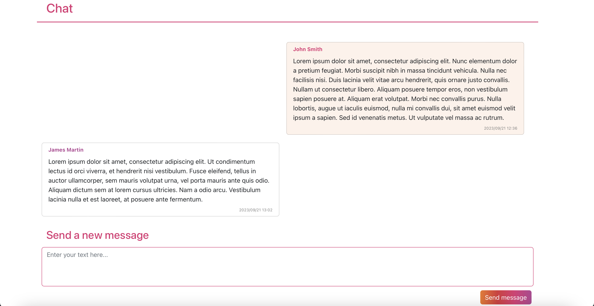
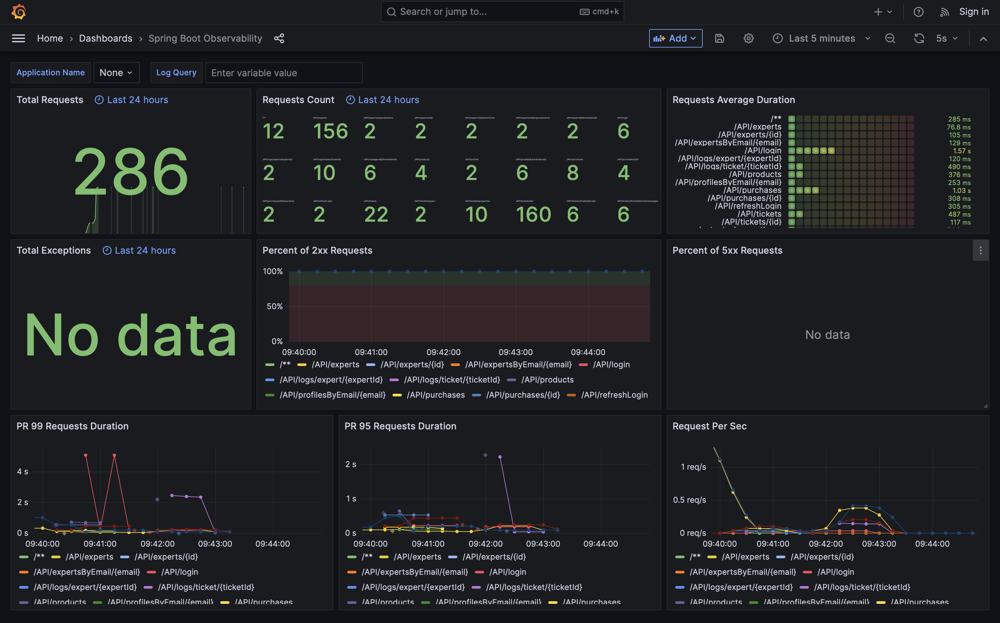

# Web Applications II Labs
### Repository per i laboratori del corso di Web Applications II
Il repository contiene i 5 laboratori e il progetto finale per il corso di Web Applications II (A.A. 2022/23, Politecnico di Torino). Ogni cartella contiene il PDF della consegna.

[🌐 Here in English](README.md)

## Lab 1: exercizi Kotlin da Exercism

4 esercizi dalla track Kotlin di Exercism: Flatten Array, Matrix, React and Word Count.

## Lab 2-5 e progetto finale: Ticketing server
I laboratori successivi e il progetto finale avevano lo scopo di creare un'applicazione per consentire a clienti di beni elettronici di inviare dei ticket di assistenza, poi gestiti da esperti specializzati e manager.

Il progetto e l'app sono puramente dimostrativi: lo scopo principale era quello di testare e mettere alla prova tutte le diverse tecnologie studiate nel corso, come ad esempio Spring Boot, Keycloak e l'integrazione tra diversi microservizi.  
Questa è la ragione per cui diverse scelte sono state compiute alla luce dell'obiettivo del progetto: fosse questa una applicazione reale, soluzioni differenti sarebbero sicuramente necessarie, come descritto nella sezione riguardante le limitazioni.

Nel progetto ci si è concentrati soprattutto sul server, che era il focus anche del corso; il progetto finale, poi, aveva il fine di testare il server sviluppando un client per lo scopo.

### Feature

- Inserisci acquisti e garanzie addizionali (per emulare l'acquisto di uno specifico bene online)
- Apri ticket relativi ad uno specifico acquisto
- Chatta con esperti per meglio spiegare il problema descritto nel ticket
- Come esperto, gestisci il livello di priorità e lo stato dei ticket e chatta con il cliente
- Come esperto, gestisci le tue specializzazioni (usate dai manager per assegnare i ticket in modo appropriato)
- Come manager, assegna gli esperti ai ticket e valuta le prestazioni degli expert analizzando i cambi apportati agli stati dei ticket

### Feature orizzontali

- Misura le prestazioni del sistema nella dashboard di Grafana monitorando il numero di richieste, la durata media delle richieste, la percentuale di richieste andate a buon fine o meno e il numero di richieste al secondo

### Tecnologie usate

- Server
	- Spring Boot (Kotlin)
	- Spring Data JPA
	- Database PostgreSQL
	- Spring Security
	- Keycloak
	- Grafana
	- Prometheus
	- Loki
	- Tempo
	- Docker Compose
	- Jib (per produrre l'immagine Docker)
- Client
	- React
	- Bootstrap

### Architettura del sistema
L'applicazione viene avviata preferibilmente dal file Docker Compose, che avvia diversi microservizi. Il microservizio `ticketing` è il server vero e proprio, che espone sia le API sia il client sulla porta 8080. Il database PostgreSQL è avviato sulla porta 5432; tutti gli altri microservizi raccolgono dati e supportano il monitoraggio delle prestazioni del sistema, che può essere svolta dalla dashboard di Grafana accessibile dalla porta 3000.

### Limitazioni e bug noti
- La chat è aggiornata attraverso un polling continuo: questo a causa di limiti di tempo, ma altre soluzioni, come i web socket, sarebbero raccomandabili
- L'implementazione dello scambio di token di Keycloak con il client è quasi certamente errata: funziona, ma non segue le migliori pratiche comunemente raccomandate. Di nuovo questo a causa di limiti di tempo e della mancanza di documentazione fornita da Keycloak o dal corso
- Sarebbero necessarie molte ottimizzazioni per migliorare le prestazioni

### Screenshot

|  Home page del cliente |  Pagina dell'acquisto |
| :-------------: | :-------------: |
|  **Pagina del ticket** |  **Chat** |
|  **Pagina del profilo dell'esperto**  |  **Pagina dell'esperto (punto di vista del manager)** |
|  **Log dell'esperto (punto di vista del manager)** |  **Grafana** |

### Contenuto delle cartelle e breve changelog
- Laboratorio 2
	- API dei prodotti e dei clienti
	- Interfaccia client minimale per verificare la corretta implementazione delle API

- Laboratorio 3 
	- API dei ticket, degli acquisti, degli esperti e dei manager
	- Test d'integrazione per verificare tutte le API (questi test non sono stati per la maggior parte aggiornati per il progetto finale)
	- Docker Compose iniziale

- Laboratorio 4
	- Login con Keycloak
	- Autorizzazione delle API a seconda del ruolo (cliente, esperto o manager)

- Laboratorio 5
	- Iscrizione di clienti ed esperti con Keycloak
	- Aggiunti i microservizi Loki, Tempo, Prometheus e Grafana al Docker Compose

- Progetto finale
	- Chat per ogni ticket
	- Garanzia standard e addizionale
	- Log dei cambi di stato dei ticket
	- Implementazione di Grafana completamente funzionante
	- Completa implementazione del client

---

Ci scusiamo se qualunque delle tecnologie, plugin o componenti usati richiedeva un riconoscimento che non è stato fornito: si sottolinea che l'app non è mai stata pensata per essere resa pubblica od operativa.